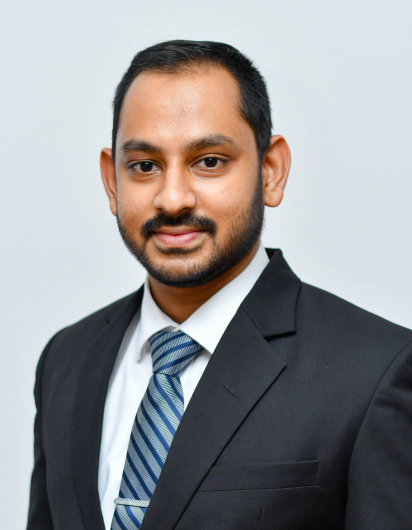

# About Me

    
    

        I’m Randeera Liyanage, a passionate researcher and engineer focusing in the areas of controls systems, robotics and edge computing.
          
        I am an academic in the field of mechatronics engineering, with a MSc in Applied Electronics from the University of Colombo Sri Lanka, and a MEng (Hons) in Mechatronics Engineering from University Wolverhampton UK (First Class). Currently working as a Lecturer in Mechatronics Engineering at CINEC Campus Sri Lanka. I have a strong interest in the areas of control systems, robotics, embedded systems and applied electronics. Aside from lecturing, my work includes research, academic documentation and industry relations.  
    

Lorem Ipsum is simply dummy text of the printing and typesetting industry. Lorem Ipsum has been the industry's standard dummy text ever since the 1500s, when an unknown printer took a galley of type and scrambled it to make a type specimen book. It has survived not only five centuries, but also the leap into electronic typesetting, remaining essentially unchanged. It was popularised in the 1960s with the release of Letraset sheets containing Lorem Ipsum passages, and more recently with desktop publishing software like Aldus PageMaker including versions of Lorem Ipsum.
